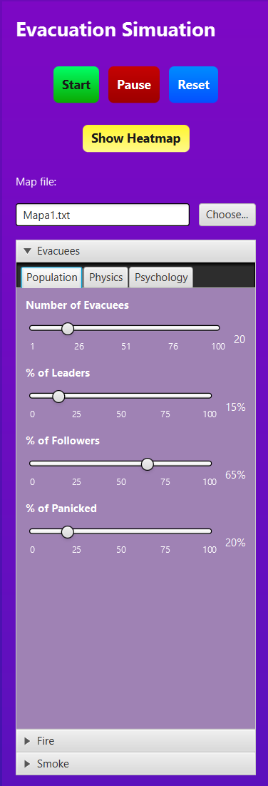
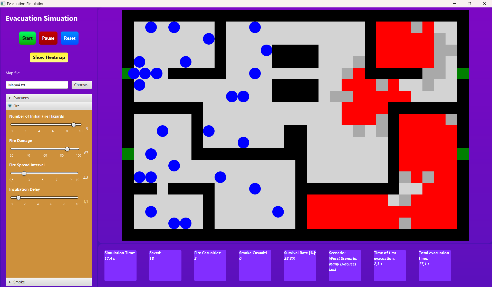
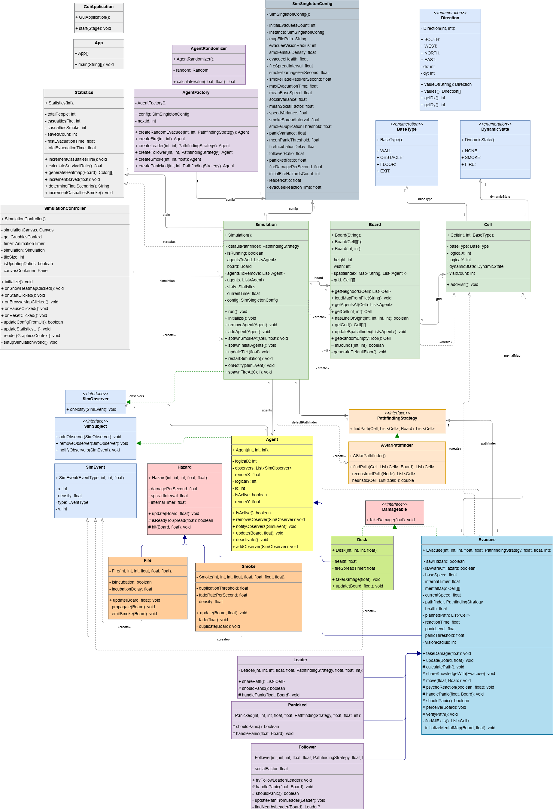
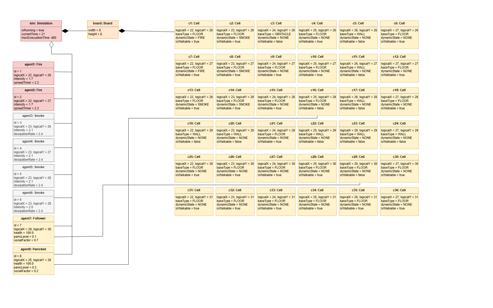
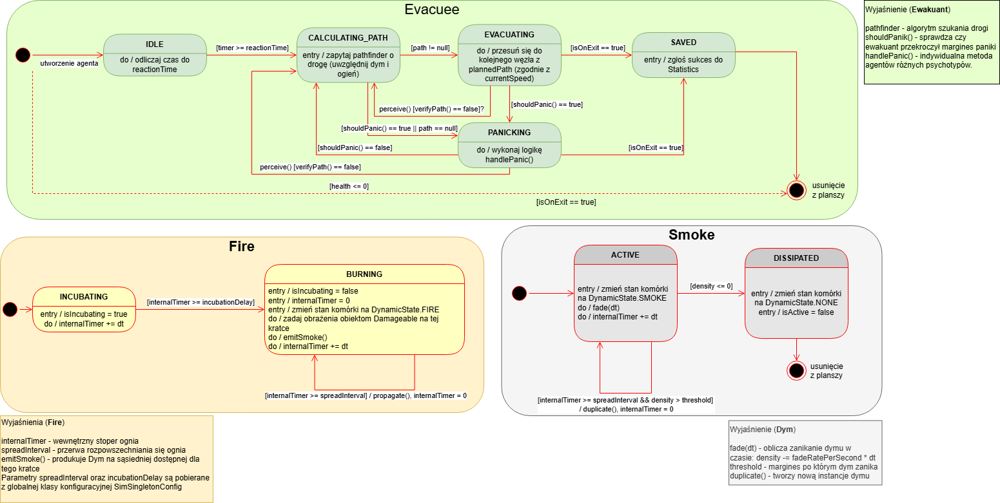
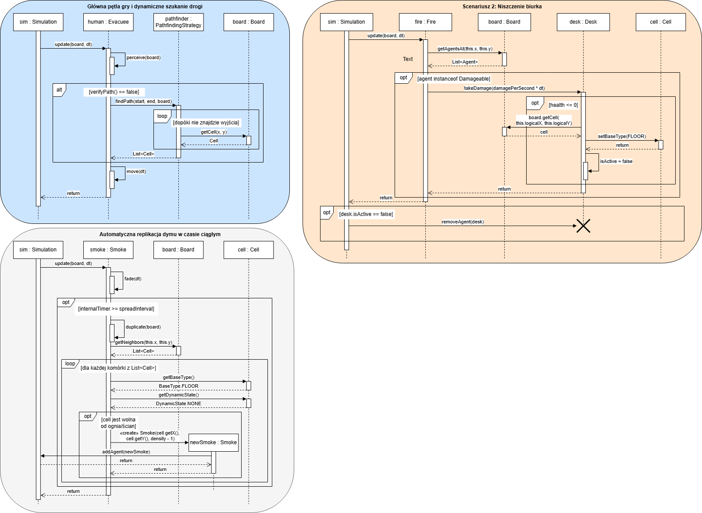

*Read in other languages: [Polski](README.pl.md)*

# Building Evacuation Simulator

## Table of Contents

* [General Information](#general-information)
* [Main Functionalities](#main-functionalities)
* [Technologies](#technologies)
* [Setup](#setup)
* [More detailed information about modules](#more-detailed-information-about-modules)
* [Application View](#application-view)
* [Authors](#authors)
* [Instructor](#instructor)
* [Additional Information](#additional-information)

## General Information
<details>
<summary>Click here to see general information about the <b>Project</b>!</summary>
<b>A crowd evacuation simulator for indoor environments. </b>
The application models people's behavior during evacuation from a building with dynamically evolving threats (fire, smoke)
  using artificial intelligence written for various agent types, state machines, and pathfinding algorithms.
The project has an interactive graphical interface allowing for the configuration of dozens of parameters in real time.
</details>

## Main Functionalities

* **A* Navigation Strategy:** Agents use the A* algorithm to find the shortest route to the exit.
  The cost of traversing cells dynamically increases if they are covered in smoke or fire, forcing agents to find safer detours.
* **Three Agent Psychological Profiles:**
  * **Leaders:** Resistant to panic, they determine optimal escape paths.
  * **Followers:** Follow leaders and react to crowds (herd factor).
  * **Panicked:** They make irrational decisions and move erratically when their stress levels exceed a certain threshold.
* **Dynamic Threats:** The fire and smoke propagation models are dynamic and realistic, dealing damage and limiting the field of view.
* **GUI:** Built with JavaFX, the interface lets you configure up to 22 initial simulation parameters,
  from the number of agents of different types to their various characteristics. You can also load your own map from a text file.
  This allows you to simulate various evacuation scenarios from different buildings.
* **Live Statistics:** The simulation continuously collects various statistics, allowing for analysis of the evacuation.
  It also allows you to generate a heatmap (created automatically after the simulation ends).

## Technologies

The project was built using the following technologies:
* **Java** (version 21)
* **JavaFX** (version 21 / interface designed in SceneBuilder)
* **Gradle** (project builder)

## Setup

To run the simulation on your local computer, follow these steps:

1. **Clone the repository:**
  ```bash
  git clone https://github.com/m1ss1ngbugs/evacuation-simulation.git
  ```
2. **Go to the project folder:**
  ```bash
  cd evacuation-simulation
  ```
3. **Run the project using Gradle:**
  * On Windows:
    ```cmd
    gradlew.bat run
    ```
  * On Linux/macOS:
    ```bash
    ./gradlew run
    ```

**Note!**
You can load your map into the simulation as a plain text file. This file must be a symbol file, where 'O' represents an obstacle, 
'#' represents a wall, 'E' represents an exit, and any other symbol is treated as a floor.
(Sample maps added to the project: "mapa1.txt", "mapa2.txt", "mapa3.txt", "mapa4.txt", "map_test.txt")

## More detailed information about modules
* src.main.java.evacuation.sim. (the main, sole module of the project)
  * agent. (a package of simulation agents)
    * hazard.
      * Fire (agent, primary threat that kills evacuees)
      * Hazard (abstract class, is extended by Fire and Smoke)
      * Smoke (agent, secondary threat that reduces visibility and deals little damage)
    * human.
      * Evacuee (an abstract class extended by the evacuees listed below in the package)
      * Follower (an agent, evacuee, escapes with the crowd)
      * Leader (an agent, evacuee, immune to panic, leads the way)
      * Panicked (an agent, evacuee, panics more easily)
    * Agent (an abstract class extended by all classes representing agents in the simulation)
    * Damageable (an interface implemented by agents that may take damage)
    * Desk (an agent, creates an obstacle in the evacuees' path, can be destroyed by fire)
  * core (the main package, the heart of the simulation)
    * Simulation (the main class, connects the entire simulation)
    * Statistics (a class that collects data for analysis from the entire simulation)
  * event. (observer package)
    * SimEvent (helper class for message transmission)
    * SimObserver (interface implemented by listeners)
    * SimSubject (interface implemented by transmitters)
  * factory (agent factory)
    * AgentFactory (factory class, responsible for creating new agents using their builders)
    * AgentRandomizer (helper class (randomizing parameters for created agents))
  * gui (simulation graphical interface)
    * GuiApplication (launches the GUI, creates the main window)
    * SimulationController (class responsible for the logic for GUI elements (collecting input from sliders, displaying statistics, etc.))
  * model (world model (MVC))
    * BaseType (enum, responsible for the basic cell type)
    * DynamicState (enum, responsible for the cell type depending on the threat)
    * Direction (enum, responsible for storing possible directions to neighboring cells)
    * Board (class responsible for cell composition, the main simulation board, stores the map and agent coordinates)
    * Cell (cell class - the basic board element)
  * routing (part of the code responsible for movement strategies)
    * PathfindingStrategy (interface responsible for accessing various pathfinding strategies)
    * AStarPathfinder (class responsible for implementing the pathfinding algorithm)
* src.main.java.resources
  * main_layout.fxml (JavaFX .xml file responsible for the GUI layout and styles)

## Application View


*Main configuration panel with sliders.*


*Agent evacuation during a fire.*

## Authors

This project was carried out as part of the Object-Oriented Programming laboratory course.

    Heorhii Yartsev (293562)
    
    Bartłomiej Krajewski (293439)

## Instructor

    Ph.D. Eng. Paweł Majewski
    pawel.majewski@pwr.edu.pl

## Additional Information


*Class diagram of the project*


*Object diagram of the project*


*State machine diagram of the project*


*Sequence diagram of the project*

Full technical documentation including local package diagrams has been automatically generated (in Javadoc). To **view it**, open the `index.html` file located in the `build/docs/javadoc/` directory.

*Note: The `build` directory is generated locally. If you cannot find this directory, build the documentation manually by running the* `./gradlew javadoc` *command in your terminal (or `gradlew.bat javadoc` on Windows).*
